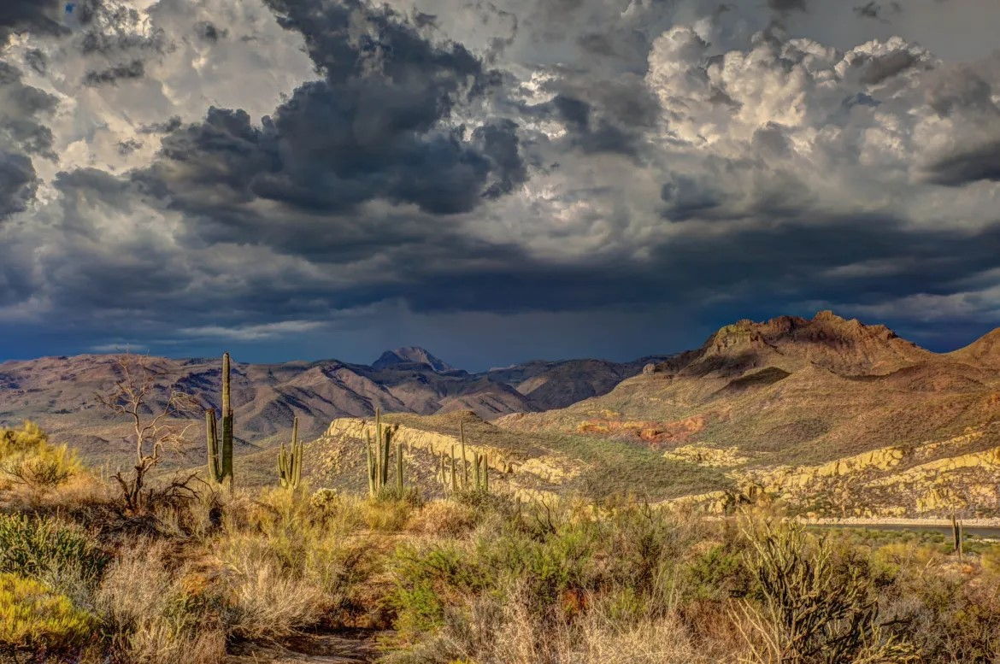

# Phoenix Biodiversity Intactness
## Examining the changing BII of Maricopa County



Image credit: [azsustainabilityalliance.com](https://www.azsustainabilityalliance.com/biodiversity-loss-in-arizona-what-we-can-do-about-it/)

This repository holds the notebook `biodiversity_intactness_index.ipynb` which aims to visualize the parts of the Phoenix subdivision of Maricopa County, Arizona with an observed decrease in biodiversity. It uses biodiversity intactness index data and geospatial data to highlight changes to biodiversity in the area from 2017-2020. 

## Data

All data used is housed locally within the repository in the `data` folder and was originally sourced from the sources listed below. 

## Acknowledgments & References

All materials were created by [Carmen Galaz-Garcia](https://github.com/carmengg) for [EDS-220: Working with Environmental Data](https://meds-eds-220.github.io/MEDS-eds-220-course/).

1. U.S. Geological Survey. (n.d.). *Landsat 8-9 OLI/TIRS collection 2 level-2 science products | USGS EROS Archive*. U.S. Geological Survey. https://www.usgs.gov/centers/eros/science/usgs-eros-archive-landsat-archives-landsat-8-9-olitirs-collection-2-level-2 Access date: November 19, 2024.

2. Data.gov. (2024). *California fire perimeters (ALL)*. Data.gov. https://catalog.data.gov/dataset/california-fire-perimeters-all-b3436 Access date: November 19, 2024.

3. Airnow.gov. (2017-2018).  *US Environmental Protection Agency.* [Air Quality Index (AQI)](https://www.airnow.gov/aqi/aqi-basics/) data from the [US Environmental Protection Agency](https://www.epa.gov)  Access date: October 26, 2024.


## Repository Organization

```
├── data
│   └── arizona_lines.zip  # Arizona county boundary data
├── images
│   ├── Arizona_Biodiversity.jpeg
│   └── Phainopepla_Arizona.jpg
├── .gitignore
├── README.md
└── biodiversity_intactness_index_phoenix.ipynb # Jupyter notebooks for analysis
```